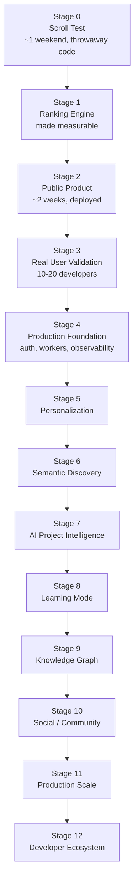
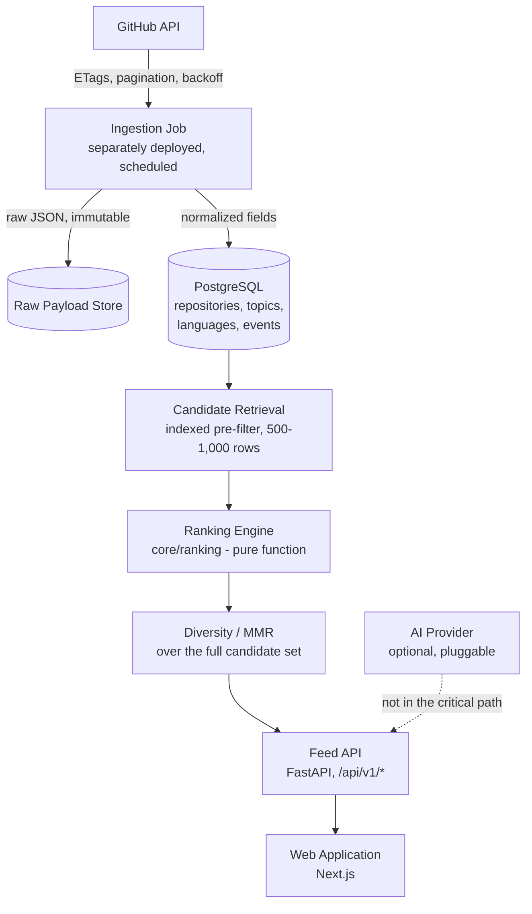
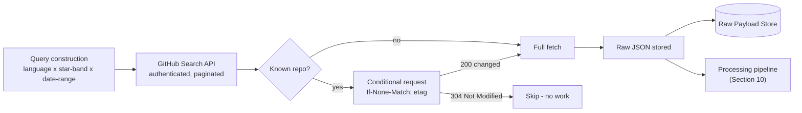
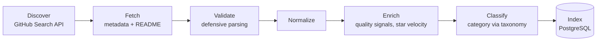
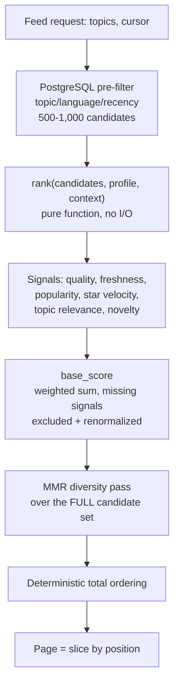
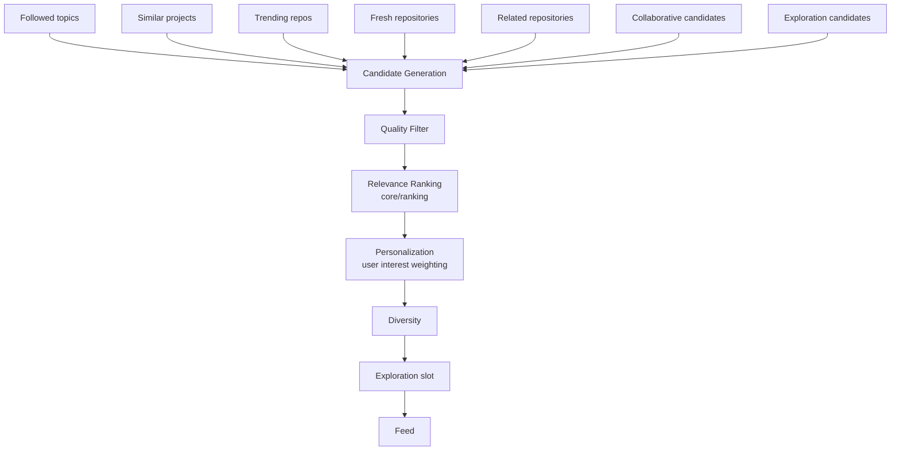
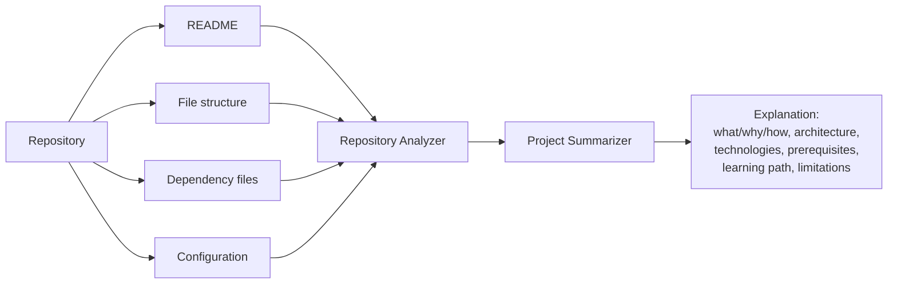
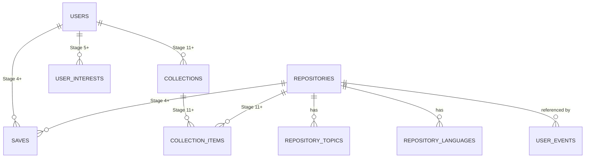

# DevFeed

Developer Discovery & Learning Platform

Project Documentation

---

DevFeed is a personalized discovery feed for developers, built on top of GitHub's repository ecosystem. Instead of scrolling entertainment content, you scroll GitHub repositories — AI projects, developer tools, data engineering work, research implementations, infrastructure and security tools, robotics, and anything else people are actively building in the open. It's a discovery engine for builders, not a GitHub search wrapper and not a social network clone.

This is the working reference for the product and the engineering behind it: what we're building, why, in what order, and how each part works.

## Table of Contents

1. [Project Overview](#1-project-overview)
2. [Vision and Problem](#2-vision-and-problem)
3. [Goals and Non-Goals](#3-goals-and-non-goals)
4. [Users and Core Experience](#4-users-and-core-experience)
5. [Development Strategy](#5-development-strategy)
6. [Feature Scope](#6-feature-scope)
7. [System Architecture](#7-system-architecture)
8. [Technology Stack](#8-technology-stack)
9. [GitHub Ingestion](#9-github-ingestion)
10. [Repository Data Model](#10-repository-data-model)
11. [Repository Quality and Classification](#11-repository-quality-and-classification)
12. [Ranking Engine](#12-ranking-engine)
13. [Feed Generation and Pagination](#13-feed-generation-and-pagination)
14. [Search](#14-search)
15. [Personalization and Recommendations](#15-personalization-and-recommendations)
16. [AI Project Intelligence](#16-ai-project-intelligence)
17. [Learning and Knowledge Layer](#17-learning-and-knowledge-layer)
18. [Social and Community](#18-social-and-community)
19. [Database Architecture](#19-database-architecture)
20. [API Specification](#20-api-specification)
21. [Security and Data Handling](#21-security-and-data-handling)
22. [Deployment and Infrastructure](#22-deployment-and-infrastructure)
23. [Observability](#23-observability)
24. [Testing and Evaluation](#24-testing-and-evaluation)
25. [Development Workflow](#25-development-workflow)
26. [Milestones and Gates](#26-milestones-and-gates)
27. [Future Roadmap](#27-future-roadmap)
28. [Immediate Next Steps](#28-immediate-next-steps)

---

## 1. Project Overview

### What DevFeed is

A personalized feed for developers. You pick a handful of interests, and DevFeed shows you a ranked stream of GitHub repositories worth knowing about — AI and ML projects, developer tools, data engineering pipelines, research implementations, cloud and infrastructure projects, security tools, robotics, and general engineering work. Each card explains what the project is, what it's built with, how healthy it looks, and why it was ranked here. You save what's interesting, open it on GitHub, or keep scrolling.

"Instagram for GitHub" is a fast way to explain the format to someone, but it isn't the product definition. The product is a discovery engine for builders: GitHub's repository ecosystem turned into something personalized and explorable, not just searchable.

### The problem

There's an enormous amount of valuable technical work on GitHub, and discovery for it is fragmented. Right now, people find interesting projects through GitHub search, GitHub Trending, Hacker News, Reddit, X, newsletters, Discord, blogs, YouTube, "awesome" lists, and word of mouth. Every one of these is search-driven, community-driven, or popularity-driven, and none of them personalize well. GitHub itself is built for managing and collaborating on software, not for helping someone discover software they didn't know they were looking for.

### Why it's different

The feed optimizes for useful discoveries per session, not time spent in the app. There are no fake notifications, artificial scarcity, engagement bait, or misleading popularity signals. Stars are treated as one input among several — repository quality is scored separately, and a 200-star repo can rank above a 100,000-star one if it's better maintained, better documented, and more relevant to what someone's interested in.

### What we're building first

A working feed with real ranking, backed by real GitHub data, that a developer would actually want to scroll. Nothing more, until that's proven. Section 5 lays out exactly what that includes stage by stage.

### Where it's eventually going

If the core feed works, DevFeed grows into a platform where repositories can explain themselves (AI-generated summaries of architecture and purpose), personalization is built from real behavior instead of just selected topics, search understands natural language, and projects connect to the concepts and prerequisites behind them through a learning layer. All of that is described later in this document as future roadmap — it is the destination, not the current build, and none of it gets built ahead of the evidence that justifies it.

---

## 2. Vision and Problem

### Product thesis

Developers should have a personalized technical discovery feed that answers one question: what interesting thing should I know about today?

There's a second question we genuinely don't know the answer to: do developers actually want a *recurring* feed, or is this closer to an on-demand search tool people reach for when they have a specific need? Developer discovery could be habitual, occasional, need-driven, or search-driven. Stage 3 (real user validation, Section 5) is built specifically to answer this before anything gets built that assumes one or the other.

### Product philosophy

The feed optimizes for:

- Discovery, curiosity, learning
- Technical quality and relevance
- Novelty — not just what's already popular
- Developer growth

It explicitly does not optimize for screen time, addictive behavior, notification volume, or vanity metrics. The measurable target is useful discoveries per session, not minutes spent in the app.

### Success criteria

DevFeed is working if it consistently shows a developer something they didn't know existed, that they genuinely want to explore, learn from, contribute to, or build themselves. The desired reaction after a session: "I opened this for five minutes and found something I actually want to build."

### Validation assumptions

Two assumptions carry real product risk and are treated as unproven until tested:

1. **GitHub repositories can be ranked well enough to make a feed worth scrolling.** This is tested first, in Stage 0, before any production infrastructure exists.
2. **Developers want a recurring discovery feed**, as opposed to an on-demand search tool. This is tested in Stage 3, with real usage data from real developers, not assumed in advance.

### Kill criteria

These are decided in advance so they don't get argued away later:

- If Stage 0 fails after a real week of iterating on the ranking heuristics, the repository corpus or filtering approach is the problem — narrow the domain or reconsider the feed concept before writing more code.
- If repository opens per session stay below roughly 2 after several ranking revisions, the ranking approach isn't working — consider search-first instead of feed-first.
- If there are no meaningful returning users by the end of Stage 3, the product may be useful without being habitual, which changes what gets built next (see the Stage 3 pivot in Section 5).
- If active personal use of the product stops for two weeks, that's real product evidence — it doesn't get overridden just because a lot of code already exists.

---

## 3. Goals and Non-Goals

### Goals

- Prove the ranking concept before investing in infrastructure.
- Ship a real, usable feed as early as possible, not a polished demo.
- Keep ranking explainable — every ranked result should be able to answer "why is this here?"
- Keep the architecture simple until complexity is justified by an actual, demonstrated problem.
- Build on free-tier infrastructure until the product proves demand. The initial budget target is zero — GitHub, open-source software, free hosting, free databases, local models where practical. The first real expense is likely just a domain name.

### Non-goals, for now

Not building any of the following until a specific trigger (Section 26) makes it necessary:

- Complex authentication, social graph, notifications, comments, messaging
- Deep-learning-based recommendations
- Kubernetes, Kafka, a dedicated vector database, Elasticsearch/OpenSearch
- Elaborate admin dashboards, mobile native apps
- Payment systems, monetization, enterprise features

None of this is a permanent rejection — it's sequencing. Each item has a named trigger condition later in this document, and nothing gets built ahead of its trigger regardless of how far along the roadmap looks.

---

## 4. Users and Core Experience

### Who it's for

- **AI enthusiasts** — LLMs, agents, RAG, computer vision, AI infrastructure
- **Data engineers** — Spark, Airflow, dbt, lakehouses, ETL, data platforms
- **Software developers** — backend, frontend, APIs, system design, open source
- **Students** — finding projects and research at the right skill level
- **Researchers** — implementations of papers and research tooling
- **Open source contributors** — active repositories worth contributing to

### The core loop

```
Discover → Understand → Save → Learn → Build → Contribute → Discover again
```

### Ideal session

```
Open DevFeed
      ↓
Select interests
      ↓
Personalized feed
      ↓
Discover a project
      ↓
Understand it (why it matters, how it works)
      ↓
Open it on GitHub
      ↓
Save it
      ↓
Discover a related project
      ↓
Learn the underlying concept
      ↓
Build something similar
```

The later steps in this loop (deep understanding, related-project discovery, learning paths) belong to future stages. What matters for the current build is the first half: discover, understand at a glance, save, open.

---

## 5. Development Strategy

DevFeed is built in stages, and each stage has to earn the next one. The riskiest assumption — that GitHub repositories can be ranked well enough to make a feed worth scrolling — is tested first, before any production infrastructure exists.



### Current build: Stage 0 through Stage 3

| Stage | Objective | Output | Gate |
|---|---|---|---|
| 0 — Scroll Test | Prove a ranked feed of GitHub repos is genuinely interesting | 100 ranked repos, static HTML page | ≥15/100 clickable, ≥3 previously unknown and interesting, <20/100 obvious junk |
| 1 — Ranking Engine | Make ranking measurable instead of vibes-based | Labeled evaluation dataset, evaluation harness | Precision@25 ≥ 0.50, junk rate < 10%, 5+ categories in top 25 |
| 2 — Public Product | Smallest real, deployed version | Public URL, live feed, automatic nightly ingestion | Loads fast, 200+ browsable repos, ranking tests passing, used personally for 5 days |
| 3 — User Validation | Test with real developers, not just internally | Usage data from 10–20 developers | ≥2 repository opens/session, ≥5% save rate, ≥30% day-7 return |

Stage 0 through Stage 3 is roughly six to eight weeks of work. Everything past that is earned by evidence, not scheduled by calendar.

### Future: Stage 4 and beyond

| Stage | Focus |
|---|---|
| 4 — Production Foundation | Authentication, background workers, structured observability — introduced one at a time, each behind its own trigger |
| 5 — Personalization | Behavioral user profiles replacing topic-only selection |
| 6 — Semantic Discovery | Embeddings and similarity search |
| 7 — AI Project Intelligence | The project explainer and codebase-understanding layer |
| 8 — Learning Mode | Projects connected to prerequisites and learning paths |
| 9 — Knowledge Graph | Technologies, concepts, and projects as a connected graph |
| 10 — Social / Community | Following developers and topics, comments, activity — deliberately last |
| 11 — Production Scale | Whatever the system actually needs at real scale, decided when that's real |
| 12 — Developer Ecosystem | Long-term platform direction — see Section 27 |

### Stage 3 pivot

If users find individual projects useful but don't come back regularly, that's a legitimate outcome, not a failure: DevFeed may be a strong discovery/search tool rather than a daily feed. In that case the natural pivot is search-first, with the feed as a secondary discovery surface rather than the primary interface.

---

## 6. Feature Scope

The complete product is made up of the following modules. Not all of them exist yet — the table marks what's part of the current build versus future roadmap.

| Module | Status |
|---|---|
| GitHub Discovery (ingestion) | Current |
| Repository Intelligence (quality, classification) | Current |
| Feed | Current |
| Ranking Engine | Current |
| Search (full-text) | Current |
| Personalization (topic selection) | Current |
| Recommendation Engine (behavioral, content-based, collaborative) | Future |
| Semantic Discovery (embeddings) | Future |
| AI Project Explainer | Future |
| Codebase Understanding | Future |
| Learning Mode | Future |
| Learning / Knowledge Graph | Future |
| Collections | Future |
| Developer Profiles | Future |
| Social Layer | Future |
| Analytics | Current (minimal) / Future (full) |
| Administration Tools | Future |
| Content Moderation | Future |
| Infrastructure & Observability | Current (minimal) / Future (full) |

---

## 7. System Architecture



### Architectural principles

**Modular monolith, not microservices.** Domain boundaries are enforced by module structure, not network boundaries, until a specific component demonstrably needs independent scaling or deployment. No distributed architecture gets introduced prematurely.

**The ranking engine sits outside the API**, in its own module (`core/ranking/`), because it is the core technical asset of the product and will eventually be shared across feed, search, trending, and recommendations. It has no framework, database, or network dependency — it takes candidates and a user profile in and returns a ranked, explainable list out. The API depends on ranking; ranking never depends on the API.

**Ingestion is a separate deployment target from the API**, not a cron process riding on the same host. An API redeploy should never silently affect whether ingestion runs, and the reverse should hold too.

**Ranking never touches the full corpus.** PostgreSQL pre-filters to a bounded candidate set — 500 to 1,000 rows via an indexed query on topic, language, and recency — before anything reaches the ranking engine. Running the diversity pass against tens of thousands of candidates on every request would blow the feed's performance budget.

**AI is an enhancement layer, never a dependency.** If the AI provider is unavailable, slow, or erroring, the feed, search, and save functionality keep working unaffected.

**GitHub is treated as an unreliable external dependency**, not a data source under our control. Rate limits, partial fields, downtime, and stale data are the expected case, not the exception — ingestion code is written defensively throughout.

### External dependencies and failure posture

| Dependency | Failure mode | System response |
|---|---|---|
| GitHub API | Rate limit exhausted, 5xx, timeout | Ingestion backs off and retries; stale data is served; the feed is unaffected |
| AI Provider (future) | Unavailable, slow, erroring | Explainer/summary features degrade gracefully; feed, search, and saves are unaffected |
| PostgreSQL | Unavailable | Full outage — the one dependency the system cannot degrade around |

### Non-goals for the current architecture

Microservices, Kubernetes, Kafka or any event-streaming platform, Elasticsearch/OpenSearch, Redis/Celery/background task queues, pgvector or any vector database, authentication, social graph. Each has a specific trigger condition listed in Section 26.

---

## 8. Technology Stack

**Frontend** — Next.js, React, TypeScript, Tailwind CSS. Feature-organized (`feed/`, `repository/`, `search/`, not one giant `components/` directory). Built on reusable design tokens — typography, spacing, color, buttons, cards, badges, navigation, dialogs — rather than styling decisions scattered across individual components, with both dark and light mode supported from the start. Dark mode is the default; the visual language stays dense and technical, not a copy of Instagram or TikTok's visual style.

**Backend** — Python, FastAPI, Pydantic for validation, SQLAlchemy + Alembic for the database layer.

**Database** — PostgreSQL. Full-text search now, with room for `pgvector` in the same engine later, avoiding a second data store until it's genuinely needed.

**GitHub** — GitHub REST/Search API, authenticated.

**Ranking** — Deterministic Python, no machine learning. See Section 12.

**Search** — PostgreSQL full-text search initially (`tsvector`).

**AI (future)** — A provider-independent LLM/embedding abstraction, introduced when Stage 7 actually starts. No vendor is chosen yet, because nothing depends on one.

**Infrastructure** — Docker Compose locally, for PostgreSQL only; the API and frontend run natively in development. Free-tier hosting to start: Vercel for the frontend, Fly.io or Railway for the API, Neon or Supabase for Postgres.

**Explicitly rejected for the current stage** — Kafka (no event-streaming need exists), a dedicated vector database (pgvector covers it inside Postgres once needed), GraphQL (REST is sufficient for six endpoints).

---

## 9. GitHub Ingestion



### GitHub API usage

Ingestion uses GitHub's Search API, authenticated, with rate limits monitored on every response via `X-RateLimit-Remaining`. Authenticated requests get 5,000/hour. Ingestion sleeps proactively before exhaustion instead of reacting to a 403, and backs off with jitter on `403` and `5xx` responses, with retries.

### Query strategy — language, star, and date slicing

GitHub's Search API caps out at 1,000 results per query, so a single query like `language:python` cannot enumerate every matching repository. The corpus is built by slicing the search space across language, star range, and date so each individual query stays well under the cap:

- **Languages:** Python, TypeScript, Rust, Go
- **Star bands:** `50..100`, `100..250`, `250..1000`, `1000..5000`, `>5000`
- **Date ranges:** concrete calendar-month ranges across the trailing 12 months — real dates, not a symbolic placeholder

```python
from datetime import date
from calendar import monthrange

LANGUAGES = ["python", "typescript", "rust", "go"]
STAR_BANDS = ["50..100", "100..250", "250..1000", "1000..5000", ">5000"]

def month_ranges(months_back: int = 12) -> list[str]:
    """Yields concrete 'YYYY-MM-DD..YYYY-MM-DD' ranges, e.g. '2026-07-01..2026-07-31'."""
    ranges = []
    today = date.today()
    for i in range(months_back):
        y, m = today.year, today.month - i
        while m <= 0:
            m += 12
            y -= 1
        last_day = monthrange(y, m)[1]
        ranges.append(f"{y:04d}-{m:02d}-01..{y:04d}-{m:02d}-{last_day:02d}")
    return ranges

for lang in LANGUAGES:
    for stars in STAR_BANDS:
        for date_range in month_ranges():
            query = f"language:{lang} stars:{stars} pushed:{date_range}"
            # e.g. "language:python stars:250..1000 pushed:2026-07-01..2026-07-31"
            # paginate up to 1000 results per query
```

This produces roughly 240 queries. Expected order of magnitude is 10,000–20,000 unique repositories on the first run — that's a planning estimate to size the work, not something the architecture depends on. Actual yield is measured empirically during Stage 0, not assumed.

### Conditional requests and rate limits

Every re-fetch of a known repository sends `If-None-Match` with the stored ETag. A `304` response means there's nothing to do — unchanged data is never re-fetched. This keeps ingestion cheap on repeat runs and respects GitHub's rate limits by design, not just by throttling.

### Incremental synchronization and sync bookkeeping

Every repository row tracks `last_synced_at`, `etag`, `last_modified`, `sync_status` (`pending` / `ok` / `error`), and `sync_error`. A repository that fails to parse or fetch is marked `error` with a reason and skipped — it never aborts the batch. One repository's failure never takes down the whole ingestion run.

### Defensive parsing

GitHub API responses are treated as partial by default. Every field access tolerates `null`, missing keys, and unexpected types. Nothing downstream assumes `description`, `license`, `topics`, or `homepage` is present. README content and contributor/release information are fetched as a secondary step, only for repositories that survive the initial metadata-based filter, to avoid doubling the request count unnecessarily.

### Raw payload preservation

Raw API responses are stored before any transformation and are never discarded — this is what lets us re-score or re-classify later without re-fetching from GitHub. Access goes through a small `RawPayloadStore` interface rather than direct filesystem calls, so the backing store can change without touching ingestion logic:

```python
class RawPayloadStore(Protocol):
    def put(self, key: str, payload: bytes) -> None: ...
    def get(self, key: str) -> bytes: ...
    def exists(self, key: str) -> bool: ...
    # key convention: "github/{YYYY-MM-DD}/{search|repositories}/{identifier}.json"
```

| Stage | Implementation | Durability |
|---|---|---|
| 0 (local experimentation) | `FilesystemRawPayloadStore` → local disk | Adequate — nothing is deployed yet |
| 2+ (anything deployed) | Object storage (any S3-compatible option) via `ObjectStorageRawPayloadStore` | Durable across redeploys |

Local disk is fine for Stage 0 because nothing is expected to survive between runs. It stops being sufficient the moment ingestion runs on hosted infrastructure — free-tier platform filesystems are ephemeral, and a redeploy would otherwise silently destroy the raw corpus. The specific object storage provider behind the interface is not yet decided; it's a configuration choice made when Stage 2 deployment actually happens, since any S3-compatible option works behind the same interface.

### Ingestion deployment

Ingestion runs as its own scheduled job — the hosting platform's scheduler or a GitHub Actions cron trigger — never as a background process riding inside the API server.

---

## 10. Repository Data Model



For every ingested repository, DevFeed captures, where GitHub provides it:

- Repository ID, owner, name, full name, URL
- Description, homepage, topics, primary language, full language breakdown
- Stars, forks, watchers, open issue count
- License (SPDX identifier where available)
- Default branch, created/updated/pushed timestamps
- Archived state, fork state
- README metadata (size, presence of code blocks)
- Contributor count, release history

This data is never assumed complete — GitHub records are frequently missing fields, and every downstream consumer of this data handles absence explicitly rather than assuming presence.

The processing pipeline is a sequence of independently observable, independently retryable stages: discover candidates, fetch their data, validate what came back, normalize it into a consistent shape, enrich it with derived signals (quality score, star velocity), classify it into a category, and index it into PostgreSQL. Two later stages — embedding generation and recommendation precomputation — are future work (Stage 6+) and are not part of the current pipeline.

---

## 11. Repository Quality and Classification

Not every ingested repository belongs in the feed. Filtering and classification happen before ranking, so ranking only ever sees repositories worth ranking.

### Positive signals

A meaningful description, GitHub topics, a license, a README with actual code examples, recent activity, multiple contributors, tests, CI configuration, releases, general documentation quality.

### Negative signals

Archived, forked, or effectively dead repositories; a name or description matching a known junk pattern; suspicious star growth that looks manufactured rather than organic; a README that's mostly badges with little substance.

### Junk patterns

Maintained as configuration, not hard-coded into application logic, so the list can be extended without a code change:

```
awesome-, -awesome, tutorial, course, bootcamp, interview-, -questions,
roadmap, cheatsheet, dotfiles, my-portfolio, learning-, 100-days,
leetcode, hackerrank, curriculum, resources, -notes, study-,
practice-, assignment
```

### Quality score

Stars do not equal quality. The quality score is a composed, explainable signal built from documentation presence, license presence, test presence, CI presence, contributor count, release activity, and general maintenance recency — never from popularity alone. Every component of the score is inspectable; nothing about it is a black box.

### Category taxonomy

Category is used for the diversity evaluation (Section 12) and eventually for filtering, so it has to be reproducible, not a free-text guess. It's derived deterministically from a fixed topic-to-category lookup table (`ai-agents` maps to `AI`, `dbt` maps to `Data Engineering`, and so on), not a classifier. A repository's category is the highest-priority topic match against that table; repositories with no match fall into `Uncategorized` and are excluded from the diversity metric rather than silently miscounted.

The table is maintained by hand and carries a version number, incremented whenever a change could alter a repository's assigned category:

```yaml
# data/taxonomy/topic_categories.yaml
taxonomy_version: 1
categories:
  AI:
    - ai
    - llm
    - rag
    - agents
  Data Engineering:
    - airflow
    - dbt
    - spark
```

Every evaluation run records which taxonomy version it used, and results from different versions are never compared directly — a taxonomy edit should never be mistaken for a ranking regression. This is one integer in a config file and one field in the evaluation output; it doesn't require any versioning infrastructure.

### Difficulty

Not currently defined or exposed. A repository "difficulty" badge would need a real signal set — codebase complexity, prerequisite depth, documentation for newcomers — none of which is computed yet. A guessed difficulty rating is worse than none at all, so this field stays absent from the product until it has an actual deterministic definition behind it.

---

## 12. Ranking Engine

This is the core of the product. Everything else is delivery mechanism around it.



### The ranking function

```python
def rank(
    candidates: list[Repo],
    profile: UserProfile,
    ctx: Context,
) -> list[RankedRepo]:
    """Pure function. No I/O. No framework imports.
    Every RankedRepo carries a score_breakdown."""
```

`rank()` lives in `core/ranking/`, outside the API. It never imports FastAPI, SQLAlchemy, `requests`, or any GitHub client — candidates and the user profile arrive as plain data, ranked results come out. It's deterministic, not ML-based, at this stage, and every result is explainable: the system can always answer "why did this project appear here?"

### Ranking signals

| Signal | What it measures | Notes |
|---|---|---|
| Quality | Docs, license, tests, CI, contributor count, release count, maintenance recency | Explainable per field — see Section 11 |
| Freshness | Days since last push, days since last release | Recent meaningful activity, not just any commit |
| Popularity | Stars, forks | Weight is deliberately capped; must not dominate the final score |
| Star velocity | Recent star growth, relative to total | Two explicit fields — see below |
| Topic relevance | Overlap between repo topics/description and selected interests | Keyword-based for now; embedding-based from Stage 6 |
| Novelty | Inverse popularity within a relevant cluster | Stops the feed from only surfacing already-famous repos |

Each signal is normalized to `[0, 1]` independently before weighting, so tuning one doesn't fight the others' scale.

### Star velocity

Stored as two explicit fields, not one opaque number, so both the absolute and relative growth are inspectable:

```python
raw_star_growth_30d: int      # stars gained in the trailing 30 days
star_growth_ratio_30d: float  # raw_star_growth_30d / max(total_stars, 1)
```

The normalized signal fed into ranking is `star_growth_ratio_30d`, clipped to `[0, 1]` — a repo doubling its stars in 30 days is an extreme case and should saturate the signal rather than distort the scale.

**Missing data.** When stargazer history is unavailable or too expensive to fetch (very high-star repos with deep pagination), `raw_star_growth_30d` is left `null` — never guessed or imputed. A repository with a missing signal has that signal **excluded from the weighted sum, with the remaining weights renormalized**, rather than scored as zero:

```python
def weighted_score(signals: dict[str, float], weights: dict[str, float]) -> tuple[float, list[str]]:
    """Signals with a None value are excluded; remaining weights are renormalized to sum to 1."""
    available = {k: v for k, v in signals.items() if v is not None}
    excluded = [k for k, v in signals.items() if v is None]
    total_weight = sum(weights[k] for k in available) or 1.0
    score = sum(weights[k] * available[k] for k in available) / total_weight
    return score, excluded
```

Zero is the minimum of a `[0,1]` signal, so substituting it would actively penalize a repository for missing data rather than treating it neutrally — a well-maintained repo with unmeasured velocity would rank below an identical repo with a confirmed-zero velocity, which is backwards. Excluded signals are surfaced in the API response (`excluded_signals`) rather than silently dropped. If more than roughly 20% of the corpus ends up with excluded signals, that's a sign to improve ingestion coverage, not to change the scoring rule.

The exact data source — the GitHub stargazers endpoint (`Accept: application/vnd.github.star+json`) versus GH Archive `WatchEvent` data — isn't decided yet; it's chosen during Stage 1 once corpus size shows which one is fast enough at scale. The field definitions above hold regardless of which source populates them.

### Diversity — MMR

Ten near-identical repos in a row kills a feed even if each one individually scores well. After base scoring, maximal marginal relevance runs over the **entire bounded candidate set**, not per page:

```
1. Vectorize candidates: TF-IDF over description + topics + primary language
2. Greedily pick, at each step, the candidate maximizing:
       lambda * relevance_score - (1 - lambda) * max_similarity_to_already_selected
3. lambda starts at 0.7, tuned against the evaluation set
```

Running MMR across the whole candidate set instead of one page at a time matters for correctness, not just speed. MMR's output for an item depends on what's already been selected, so ranking only enough candidates to fill one page would make a repository's score depend on which page it happened to land on, leaving nothing stable to paginate against (Section 13). Running it once across 500–1,000 candidates produces a deterministic total order; a page is a slice of it. This is TF-IDF and cosine similarity, not embedding-based — cheap and sufficient at this stage.

### Weighting

```
final_score =
      w_quality        * quality_score
    + w_freshness       * freshness_score
    + w_popularity      * popularity_score      # smallest weight
    + w_star_velocity   * star_velocity_score
    + w_topic_relevance * topic_relevance_score
    + w_novelty         * novelty_score
```

Weights live in configuration, not hard-coded, so they can be tuned without a code change and re-evaluated against the labeled dataset below.

### Evaluation methodology

At least 200 hand-labeled repositories (`good` / `meh` / `junk`), sampled across the full score range, not just the top results. An evaluation script reports, on every ranking change:

- Precision@10, Precision@25, Precision@50 against the labels
- Junk rate in the top 50
- Category diversity in the top 25 (distinct categories present)
- Intra-list diversity (mean pairwise TF-IDF distance in the top 25)
- The taxonomy version used, and the share of repositories with excluded signals

**Acceptance thresholds:** Precision@25 ≥ 0.50, junk rate under 10%, at least 5 categories in the top 25. These are starting targets, not sacred laws — they get revisited as the labeled set grows.

No ranking change ships without running through this evaluation harness. Tuning by intuition alone is not acceptable once the labeled dataset exists — every change is measured, not just discussed.

---

## 13. Feed Generation and Pagination

### Feed request flow

```
1. Request: GET /api/v1/feed?topics=ai,rag&cursor=
2. Postgres pre-filters to a bounded candidate set (<=1,000 rows) on topic/language,
   pre-sorted by a cheap heuristic like recency and stars - never the full corpus
3. The user profile is loaded - Stage 2 is just selected topics; behavioral
   weighting arrives in Stage 5
4. rank(candidates, profile, ctx) runs, in-process, no network calls
5. MMR runs across the entire candidate set, producing one deterministic
   ordering; the requested page is a slice of it
6. Response returned with a position-based cursor for the next page
```

Ranking runs synchronously in the request path at Stage 2 volumes, against the bounded candidate set from step 2, not the full corpus. It only moves to a precomputed or cached path once candidate-set size or personalization complexity makes synchronous ranking measurably too slow — not preemptively.

### Feed card fields

Repository name and owner, description, technologies/topics, star count, star velocity indicator, quality indicators, category (internal at this stage — see Section 11), an "Open on GitHub" action, and a save action.

### Onboarding

Selecting 3–5 interests from a topic list. That's the entire personalization system at Stage 2 — the feed filters and ranks against those topics. No behavioral weighting exists yet (Section 15 covers where that's headed).

### Frontend states

Loading, error, and empty states are required for the feed — not just the happy path. Keyboard navigation (`j`/`k` to move, `o` to open) is part of the intended feed interaction. Saves are `localStorage`-only at this stage; there is no server-side save until Stage 4 introduces accounts.

### Pagination — why it isn't simple offset or a naive keyset

Because the feed re-ranks candidates on every request, offset-based pagination doesn't work here, and neither does a naive score-based keyset cursor. Two distinct problems:

1. **The sort key is mutable.** `final_score` depends on `stars`, `pushed_at`, and `quality_score`, which the ingestion job rewrites regularly. A page-1 score can shift by the time page 2 is requested, causing duplicates or skipped items.
2. **MMR is page-dependent.** A repository's diversity adjustment depends on what's already been selected, so ranking a fresh candidate set for page 2 produces different scores for the same repos than page 1 did. The score isn't a stable property of a repository at all — it can't serve as a cursor key on its own.

### The solution — position cursor over a deterministic total order

MMR runs once across the entire bounded candidate set (Section 12), producing one deterministic total ordering. The feed cursor encodes a **position** in that ordering, not a score:

```json
{ "ingest_watermark": "2026-08-15T02:00:00Z", "position": 20, "repository_id": 1234 }
```

`position` and `repository_id` are integers — no floating-point value ever appears in a cursor. A rounded float (`0.81` standing in for `0.81234719`) would produce boundary mismatches and duplicate results across pages, so ordering values are never rounded anywhere they're used for comparison; rounding is a display-only concern.

**What this actually guarantees.** If no ingestion run happens between page 1 and page 2, the ordering is exactly consistent — no duplicates, no skips. If an ingestion run does land in between, the response flags `stale_cursor: true`, since the ordering may have shifted; a cursor that no longer resolves returns `INVALID_CURSOR` rather than silently restarting from page 1. This is not snapshot-isolation, and it isn't claimed to be — a snapshot table would guarantee more, but at Stage 2 ingestion is nightly and a browsing session lasts minutes, so the drift window is small and detecting it costs one timestamp comparison. Worth revisiting only if ingestion frequency increases to the point where mid-session re-ingestion becomes common.

Search pagination (Section 14) uses a simpler Postgres-native keyset over `(ts_rank, id)`, since search results aren't re-ranked by MMR and have no page-dependency problem — the same rule about not rounding ordering values still applies.

---

## 14. Search

Stage 2 search is PostgreSQL full-text search (`tsvector`) over repository name, description, and topics, filterable by language and topic, with cursor-based pagination matching the rule in Section 13. It's a genuinely different code path from the feed: search results are relevance-ranked by Postgres directly, with no involvement from `core/ranking/`. That split is deliberate, not a gap — search and feed are solving different problems right now.

**Future.** Search eventually supports filtering by difficulty, quality, activity, license, and learning value, and grows into natural language search — "show me beginner-friendly Python projects for learning RAG" — converted into structured filters plus candidate generation plus the same ranking engine the feed uses. At that point, search and feed converge onto one retrieval-and-ranking pipeline instead of two separate code paths.

---

## 15. Personalization and Recommendations



### Current: Stage 2 personalization

Selecting 3–5 interests at onboarding. That's the entire personalization system right now — the feed filters and ranks against those topics, nothing behavioral yet.

### Future: behavioral profile

Once real usage data exists, a user interest profile gets built from explicit interests, views, saves, likes, GitHub opens, and followed topics, weighted per interest:

```
AI             0.92
RAG            0.88
Agents         0.84
Python         0.81
Data           0.65
Rust           0.20
```

### Future: trending

One of the candidate sources in the diagram above. Trending is not simply sorted by star count — it combines star velocity, fork velocity, contributor growth, recent releases, general activity, and quality into one configurable weighted score:

```
Trending Score
Star Growth       30%
Fork Growth       15%
Activity          20%
Quality           20%
Community         10%
Freshness          5%
```

The exact weights are configurable and get tuned once there's real trending data to evaluate against — this is the starting formula, not a fixed constant.

### Future: recommendation engine versions

Recommendations are planned to evolve in stages, each building on the last, without jumping to deep learning before simpler methods have been evaluated:

| Version | Approach |
|---|---|
| V1 | Deterministic ranking (current — Section 12) |
| V2 | Content-based similarity (project embeddings vs. user interest vector) |
| V3 | Personalized recommendations from the behavioral profile |
| V4 | Collaborative filtering, once there's enough usage to support it |
| V5 | Hybrid recommendation combining the above |

### Future: recommendation evaluation

Separate from the Stage 1 ranking evaluation (Section 12), the recommendation layer is eventually evaluated on Precision@K, Recall@K, NDCG@K, diversity, novelty, coverage, save rate, GitHub open rate, and learning interaction rate, using offline evaluation datasets built from historical interaction events. Major recommendation changes are never made purely on intuition.

### Future: semantic discovery

When keyword/topic matching becomes insufficient, embeddings get introduced — built from README, description, topics, technologies, and architecture summary — stored using PostgreSQL/`pgvector`. A separate vector database isn't introduced unless pgvector genuinely can't keep up at the scale reached by then.

---

## 16. AI Project Intelligence



**Future — not part of the current build.** Once it exists, an "Explain this project" button answers: what is this project, why does it exist, how does it work, what's the architecture, what are the important files, what's the difficulty, what could you learn from it, how do you run it, and what are its limitations.

### AI trust

Every AI explanation is required to clearly distinguish:

- **Observed facts** — extracted directly from repository data
- **Interpretation** — AI-generated reasoning
- **Uncertainty** — things that cannot confidently be established

Architecture is never hallucinated. The system never claims "this project uses X" without evidence — if the evidence isn't there, it says so instead of inventing a diagram.

### AI abstraction

The AI layer sits behind a provider-independent interface so business logic never depends on a specific vendor:

```
LLMProvider
EmbeddingProvider
RepositoryAnalyzer
ProjectSummarizer
LearningPathGenerator
```

Support for a local model, a hosted model, and an alternative provider is designed in from the start — swapping providers is a configuration change, not a code change.

### AI cost model

Initial budget is ₹0, so the design leans on local models where practical, caching of AI results, asynchronous processing, selective analysis (not every repository gets analyzed immediately — popular or discovered repositories are prioritized), smaller models for classification tasks, and larger models reserved for genuinely complex analysis. The application functions fully without AI — if the AI service is unavailable, the feed and search continue working.

### Codebase understanding (further future)

Beyond README analysis, a repository analyzer eventually identifies directory structure, entry points, configuration, services, APIs, database integrations, AI components, frontend/backend separation, testing, and deployment setup — generating an architecture graph where possible, running asynchronously so it never blocks the feed.

### Repository security — non-negotiable

Every repository is untrusted input, always. Repository code is never executed during analysis: no `npm install`, `pip install`, `make`, arbitrary scripts, binaries, or `docker build`. Any parsing applies file size limits, parser timeouts, memory limits, and path traversal protection, and runs sandboxed. This rule applies regardless of how confident the analysis pipeline is that a given repository looks safe.

---

## 17. Learning and Knowledge Layer

**Future — not part of the current build.** The idea: a project isn't just something to look at, it's something to learn from.

```
Project -> Concepts -> Technologies -> Related Projects -> Learning Path -> Build
```

"Learn This Project" would walk through prerequisites, core concepts, architecture, important files, hands-on exploration, related projects, and a suggested path to building something similar. As an example, a RAG project would connect to a learning path covering embeddings, chunking, vector search, retrieval, prompt construction, reranking, and evaluation — with repositories recommended at each step appropriate to that level.

Longer term, projects, technologies, and concepts become nodes in a connected graph rather than isolated feed items:

```
Technology
    |
Concept
    |
Research Paper
    |
Repository
    |
Developer
    |
Learning Path
```

For example:

```
RAG
|
+-- Embeddings
+-- Chunking
+-- Vector Search
+-- Retrieval
+-- Reranking
+-- Evaluation
```

None of this exists in the current build.

---

## 18. Social and Community

**Future, and deliberately late.** Social functionality doesn't get built before the discovery engine has proven itself useful on its own — it may ultimately remain a small part of the product rather than a central one.

**Developer profiles** — eventually show projects, collections, interests, contributions, technologies, and open-source activity. Reputation is not designed around vanity metrics.

**Follows** — following developers and topics.

**Collections** — user-curated groups of saved projects, shareable, once saving 20+ repositories becomes common enough that people start losing track: "My AI Projects," "Projects I Want To Build," "Data Engineering," "Research Ideas," "Weekend Builds," and similar.

**Comments and discussion** — technical discussion on projects, prioritizing substance over engagement volume. Moderation is designed before any of this goes public — reporting, spam detection, blocking, a moderation queue, and content removal. AI moderation may assist human moderators but is never the sole mechanism for serious enforcement.

**Admin tooling** — future internal tools for inspecting repositories, diagnosing ingestion failures, triggering re-synchronization, inspecting AI analyses, reviewing reported content, and viewing system health, protected by strong authorization from the start.

---

## 19. Database Architecture



PostgreSQL, with Alembic-managed migrations reviewed by hand rather than applied blind. Foreign keys are always declared, never implicit. Every table has `created_at`; mutable tables have `updated_at`. Soft deletion is used only where a hard delete would break referential integrity someone cares about, not applied by default. No table gets created for a minor concept that could just be a column or a `jsonb` field.

### Active tables (Stage 2)

**`repositories`** — the system of record for ingested GitHub data.

| Column | Type | Constraints | Notes |
|---|---|---|---|
| `id` | `bigint` | PK | Internal ID |
| `github_id` | `bigint` | UNIQUE, NOT NULL | GitHub's own repo ID — stable across renames |
| `owner` | `text` | NOT NULL | |
| `name` | `text` | NOT NULL | |
| `full_name` | `text` | UNIQUE, NOT NULL | `owner/name`, indexed |
| `description` | `text` | NULLABLE | |
| `url` | `text` | NOT NULL | |
| `homepage` | `text` | NULLABLE | |
| `primary_language` | `text` | NULLABLE | |
| `stars` | `integer` | NOT NULL, DEFAULT 0 | |
| `forks` | `integer` | NOT NULL, DEFAULT 0 | |
| `watchers` | `integer` | NOT NULL, DEFAULT 0 | |
| `open_issues` | `integer` | NOT NULL, DEFAULT 0 | |
| `license` | `text` | NULLABLE | SPDX identifier where available |
| `is_fork` | `boolean` | NOT NULL, DEFAULT false | Hard-excluded from ranking candidates |
| `is_archived` | `boolean` | NOT NULL, DEFAULT false | Hard-excluded from ranking candidates |
| `default_branch` | `text` | NULLABLE | |
| `readme_excerpt` | `text` | NULLABLE | |
| `has_tests` | `boolean` | NULLABLE | Heuristically detected |
| `has_ci` | `boolean` | NULLABLE | `.github/workflows` presence |
| `contributor_count` | `integer` | NULLABLE | |
| `quality_score` | `numeric(4,3)` | NULLABLE | Precomputed on ingest/refresh |
| `raw_star_growth_30d` | `integer` | NULLABLE | `null` when stargazer history is unavailable |
| `star_growth_ratio_30d` | `numeric(6,4)` | NULLABLE | `raw_star_growth_30d / max(stars, 1)`, precomputed |
| `created_at_github` | `timestamptz` | NOT NULL | |
| `pushed_at_github` | `timestamptz` | NULLABLE | Primary freshness input |
| `last_synced_at` | `timestamptz` | NOT NULL | |
| `etag` | `text` | NULLABLE | For conditional requests |
| `last_modified` | `text` | NULLABLE | |
| `sync_status` | `text` | NOT NULL, DEFAULT 'pending' | `pending` / `ok` / `error` |
| `sync_error` | `text` | NULLABLE | |
| `created_at` | `timestamptz` | NOT NULL, DEFAULT now() | |
| `updated_at` | `timestamptz` | NOT NULL, DEFAULT now() | |

```sql
CREATE UNIQUE INDEX idx_repositories_github_id ON repositories(github_id);
CREATE UNIQUE INDEX idx_repositories_full_name ON repositories(full_name);
CREATE INDEX idx_repositories_primary_language ON repositories(primary_language);
CREATE INDEX idx_repositories_stars ON repositories(stars DESC);
CREATE INDEX idx_repositories_pushed_at ON repositories(pushed_at_github DESC);
CREATE INDEX idx_repositories_sync_status ON repositories(sync_status) WHERE sync_status != 'ok';
CREATE INDEX idx_repositories_last_synced ON repositories(last_synced_at DESC);
```

The last index supports the `stale_cursor` check in Section 13 by making `MAX(last_synced_at)` cheap. No separate ingestion-run table is needed for that at this stage; one is worth adding only when ingestion needs its own audit trail for other reasons.

**`repository_topics`** and **`repository_languages`** — many-to-many join tables.

```sql
-- repository_topics
repository_id  bigint  FK -> repositories.id, NOT NULL
topic          text    NOT NULL
PRIMARY KEY (repository_id, topic);
CREATE INDEX idx_repository_topics_topic ON repository_topics(topic);

-- repository_languages
repository_id  bigint  FK -> repositories.id, NOT NULL
language       text    NOT NULL
bytes          bigint  NOT NULL, DEFAULT 0
PRIMARY KEY (repository_id, language);
```

The topic index powers `?topics=ai,rag` filtering on the feed endpoint.

**`user_events`** — anonymous interaction tracking for Stage 3 validation.

| Column | Type | Constraints | Notes |
|---|---|---|---|
| `id` | `bigint` | PK | |
| `session_id` | `text` | NOT NULL | Client-generated, anonymous |
| `event_type` | `text` | NOT NULL | `PROJECT_VIEW` / `PROJECT_OPEN_GITHUB` / `PROJECT_SAVE` |
| `repository_id` | `bigint` | FK → `repositories.id`, NULLABLE | Null for non-repo events |
| `metadata` | `jsonb` | NULLABLE | Small, structured, no free-text PII |
| `created_at` | `timestamptz` | NOT NULL, DEFAULT now() | |

```sql
CREATE INDEX idx_user_events_session ON user_events(session_id, created_at);
CREATE INDEX idx_user_events_type ON user_events(event_type, created_at);
```

No columns get added here speculatively — every field maps to a metric actually defined in Section 23's analytics.

### Deliberately not active yet

There is no `users` table and no `saves` table at Stage 2. Stage 2 saves are `localStorage`-only on the client and never touch the database — a table with no writer is infrastructure built before the product needs it. `saves` is introduced at Stage 4, alongside `users`, built correctly from the start with a `user_id` foreign key rather than retrofitted onto something that predates authentication.

### Tables introduced later, at their trigger

| Table | Introduced at | Trigger |
|---|---|---|
| `users`, `user_profiles`, `saves` | Stage 4 | Authentication is built |
| `user_interests`, `likes`, `follows` | Stage 4–5 | Alongside auth / behavioral personalization |
| `repository_embeddings` | Stage 6 | Semantic discovery (pgvector) |
| `repository_analyses`, `ai_explanations` | Stage 7 | AI codebase understanding |
| `learning_paths` | Stage 8 | Learning mode |
| `collections`, `collection_items` | Later | Once users are regularly saving 20+ repos |
| `comments` | Stage 10 | Social layer |

### Migration workflow

```bash
alembic revision --autogenerate -m "add raw_star_growth_30d and star_growth_ratio_30d to repositories"
# reviewed by hand - autogenerate is a draft, not a decision
alembic upgrade head
```

---

## 20. API Specification

Base path `/api/v1/`, versioned so breaking changes get a new prefix without disturbing existing clients. OpenAPI is generated automatically by FastAPI and served at `/docs`.

### `GET /api/v1/feed`

Returns a ranked, paginated list of repositories.

**Query parameters**

| Param | Type | Required | Notes |
|---|---|---|---|
| `topics` | string, comma-separated | No | e.g. `ai,rag,agents` — filters the candidate set before ranking |
| `cursor` | string | No | Opaque cursor from a previous response; omit for the first page |
| `limit` | integer | No | Default 20, max 50 |
| `session_id` | string | Yes | Anonymous client-generated ID |

**Response `200`**

```json
{
  "items": [
    {
      "id": "1234",
      "full_name": "owner/example-project",
      "description": "An AI-powered research workflow using agents and retrieval.",
      "url": "https://github.com/owner/example-project",
      "primary_language": "Python",
      "topics": ["ai", "rag", "agents"],
      "stars": 2400,
      "raw_star_growth_30d": 320,
      "star_growth_ratio_30d": 0.1333,
      "quality_score": 0.84,
      "score_breakdown": {
        "signals": {
          "quality": 0.84,
          "topic_match": 0.92,
          "freshness": 0.71,
          "popularity": 0.44,
          "star_velocity": 0.63,
          "novelty": 0.87
        },
        "excluded_signals": [],
        "base_score": 0.84,
        "diversity_adjustment": -0.03,
        "final_score": 0.81
      }
    }
  ],
  "next_cursor": "eyJpbmdlc3Rfd2F0ZXJtYXJrIjoiMjAyNi0wOC0xNVQwMjowMDowMFoiLCJwb3NpdGlvbiI6MjAsInJlcG9zaXRvcnlfaWQiOjEyMzR9",
  "has_more": true,
  "stale_cursor": false
}
```

`excluded_signals` lists any signal that couldn't be computed for this repository and was dropped from the weighted sum with remaining weights renormalized (Section 12). `stale_cursor` is `true` when an ingestion run landed between this request and the one that issued the cursor.

Not exposed at this stage: `difficulty` has no deterministic definition yet (Section 11); `category` exists internally for the evaluation harness but has no product decision yet about UI exposure.

### `GET /api/v1/repositories/{id}`

Full detail for a single repository.

```json
{
  "id": "1234",
  "full_name": "owner/example-project",
  "description": "An AI-powered research workflow using agents and retrieval.",
  "url": "https://github.com/owner/example-project",
  "homepage": null,
  "primary_language": "Python",
  "languages": [{"language": "Python", "bytes": 84210}, {"language": "Shell", "bytes": 1204}],
  "topics": ["ai", "rag", "agents"],
  "stars": 2400,
  "forks": 210,
  "license": "MIT",
  "quality_score": 0.84,
  "pushed_at_github": "2026-08-01T12:00:00Z",
  "last_synced_at": "2026-08-15T02:00:00Z"
}
```

Returns `404` with the standard error envelope if the repository doesn't exist.

### `GET /api/v1/topics`

```json
{
  "topics": [
    {"name": "ai", "repository_count": 3210},
    {"name": "rag", "repository_count": 412},
    {"name": "data-engineering", "repository_count": 891}
  ]
}
```

### `POST /api/v1/events`

A single synchronous insert into `user_events`, returning `201` once persisted. There is no queue and no background processing behind this endpoint at Stage 2 — the insert is fast because it's a single indexed write, not because anything is deferred. If the insert fails, it fails visibly rather than being swallowed.

**Request**

```json
{
  "session_id": "f47ac10b-58cc-4372-a567-0e02b2c3d479",
  "event_type": "PROJECT_SAVE",
  "repository_id": "1234",
  "metadata": {}
}
```

`event_type` is restricted to the Stage 3 vocabulary: `PROJECT_VIEW`, `PROJECT_OPEN_GITHUB`, `PROJECT_SAVE`. The larger event vocabulary (`PROJECT_LIKE`, `PROJECT_SHARE`, `TOPIC_FOLLOW`, `USER_FOLLOW`, `SEARCH`, `AI_EXPLANATION_REQUEST`, and others) gets added only as each corresponding feature actually ships.

**Response `201`**

```json
{ "recorded": true }
```

### `GET /api/v1/search`

Full-text search over repository name, description, and topics (PostgreSQL `tsvector`, not semantic at this stage).

| Param | Type | Required |
|---|---|---|
| `q` | string | Yes |
| `cursor` | string | No |
| `limit` | integer | No |

Same item shape as `/feed`, without `score_breakdown`, since results are ranked by Postgres relevance rather than `core/ranking/` at this stage.

### `GET /health`

Liveness check, unauthenticated, unversioned.

```json
{ "status": "ok" }
```

### Error envelope

All non-2xx responses use one consistent shape:

```json
{ "error": { "code": "REPOSITORY_NOT_FOUND", "message": "Repository could not be found." } }
```

| Code | HTTP status | Meaning |
|---|---|---|
| `REPOSITORY_NOT_FOUND` | 404 | Requested repository ID does not exist |
| `INVALID_CURSOR` | 400 | Malformed or expired pagination cursor |
| `VALIDATION_ERROR` | 422 | Request failed schema validation |
| `INTERNAL_ERROR` | 500 | Unexpected server error — generic client message, full context logged server-side |

Internal stack traces are never exposed to clients.

### `session_id` lifecycle

| Property | Definition |
|---|---|
| Format | Random UUID v4 |
| Generation | Client-side, on first app load, before any network request |
| Storage | `localStorage`, under a single fixed key — never a cookie, never derived from IP or device characteristics |
| Lifetime | Persists across sessions until the user clears site storage |
| Regeneration | Only if the stored value is missing or fails UUID-format validation |
| Contents | No embedded identifying information of any kind |

It's not a credential and carries no privilege. This is the minimum needed for the Stage 3 metrics (Section 5) to function, consistent with the product's general stance of collecting only what's actually needed.

### CORS

Configured per environment. Local dev allows `localhost:3000`; production allows only the deployed frontend origin. Never wildcarded once real event data is flowing.

### Future: authentication and the wider API surface

At Stage 4, new endpoints appear under `/api/v1/auth/*`, existing endpoints gain an optional `Authorization: Bearer <token>` header, and `session_id`-scoped saves and events migrate to `user_id` scope on login. Further out, the API grows to include `/api/v1/recommendations`, `/api/v1/collections`, `/api/v1/learning`, and `/api/v1/ai`, each arriving alongside the feature it serves — none of them exist today.

---

## 21. Security and Data Handling

### Repository content

Every repository is untrusted input. Repository code is never executed — no dependency installs, no build scripts, no binaries, no `docker build`. Any future parsing is sandboxed with file size limits, parser timeouts, memory limits, and path traversal protection (Section 16).

### GitHub API compliance

Ingestion respects GitHub's rate limits and uses conditional requests to avoid unnecessary load (Section 9). Repository license information is captured and preserved; content is linked back to its GitHub source rather than reproduced, and attribution follows the license terms of each repository.

### Secrets and configuration

No secrets are ever committed. Configuration lives in environment files (`.env.local`, `.env.production`, and a committed `.env.example` with placeholders only) and determines database credentials, the GitHub token, and provider selection — never hard-coded into application code.

### Authentication and authorization

No authentication exists at Stage 2, and none is required for the core feed to work. `session_id` carries no privilege and no identifying information. Authentication, authorization, and API-level rate limiting arrive together at Stage 4 alongside accounts — secure sessions, secure cookies, and optional GitHub OAuth for deeper personalization without over-requesting permissions.

### Input validation and rate limiting

Request validation runs through Pydantic schemas at the API boundary. Rate limiting on the API itself is a Stage 4 addition, tied to authentication.

### CORS and security headers

Locked to known origins (Section 20). Standard security headers apply once the API is public-facing.

### Privacy

Analytics are minimal by design — only the three Stage 3 event types, tied to an anonymous session ID, with no free-text personal information in event metadata. Only information that maps to an actually-defined metric gets collected.

### Auditability

Internal errors are always logged server-side with full context; the client only ever sees a generic message. Audit logging for administrative actions is part of the Stage 4+ observability buildout (Section 23), introduced alongside the admin tooling it would need to cover.

---

## 22. Deployment and Infrastructure

### Local development

```
Web (Next.js) --+
                 +--> API (FastAPI) --> PostgreSQL (Docker Compose)
Ingestion -------+         ^
                     GitHub API
```

Only PostgreSQL runs in a container locally — the API and frontend run natively.

### Stage 2 production

```
Frontend   -> Vercel (free tier)
API        -> Fly.io or Railway (free tier)
Database   -> Neon or Supabase Postgres (free tier)
Ingestion  -> a separately scheduled job - platform scheduler or GitHub Actions cron,
              never a process riding inside the API server
```

Ingestion stays its own deployment target even though it may run on the same underlying provider as the API. An API redeploy should never affect whether ingestion runs, and the reverse should hold too. No container orchestration, no multi-region setup, no CDN configuration beyond the hosting platform's defaults. Infrastructure providers are configuration, not something baked into application code — swapping Neon for a different Postgres host later shouldn't touch business logic.

### Future production infrastructure

```
Frontend
   |
API
   |
Application Services
   |
PostgreSQL
   |
Redis
   |
Background Workers
   |
GitHub / AI Providers
```

None of this exists yet. Distributed architecture is not introduced ahead of a demonstrated need.

### Background processing (future)

Background jobs get introduced when repository ingestion grows large, AI analysis becomes expensive, embeddings become expensive to compute, or recommendations need precomputation — Celery with Redis, or an equivalent lightweight queue. Not used during the current stages simply because the long-term architecture mentions them.

### Caching (future)

Potential cache targets: trending repositories, popular repositories, topic feeds, repository analysis results, AI explanations, recommendation candidates. Cache invalidation gets documented wherever it's introduced, and one user's personalized data is never leaked to another through incorrect caching.

### Search infrastructure

PostgreSQL full-text search now; `pgvector` added inside the same database once semantic search is justified (Stage 6). External search infrastructure (Elasticsearch/OpenSearch) is not introduced unless scale genuinely requires it — not by default.

### Budget

The initial target is ₹0: GitHub, open-source software, free hosting, free databases, local models where practical, Docker for reproducibility. Money doesn't get spent until the product demonstrates demand — the first real expense is likely just a domain name.

---

## 23. Observability

### Current — Stage 2

Structured application logs, a `/health` liveness endpoint, and per-repository `sync_status`/`sync_error` so ingestion failures are visible without digging through logs.

### Future — Stage 4+

Metrics, tracing, and error-tracking infrastructure arrive once the first production incident is genuinely hard to diagnose without them — not built preemptively. Once introduced, the things worth tracking:

```
github_api_requests
github_rate_limit_remaining
ingestion_success_rate
ingestion_failure_rate
feed_latency
ranking_latency
database_latency
ai_request_count
ai_failure_rate
cache_hit_rate
```

### Analytics (future, full scope)

**Discovery** — repositories viewed, repositories opened, unique discoveries per session.

**Learning** — explanations requested, learning paths opened, saved learning projects.

**Recommendation** — recommendation open rate, save rate, diversity, novelty, coverage.

**Retention** — returning users, weekly active users, monthly active users.

Session length is explicitly not an optimization target, at any stage.

---

## 24. Testing and Evaluation

**Ranking** (`core/ranking/`) — the highest bar in the codebase, target 80%+ coverage: signal correctness, weighting, MMR behavior, and the shape of the explainability output. This is the module least allowed to regress silently.

**Ingestion** — integration tests against recorded fixtures, covering defensive parsing of missing fields and rate-limit backoff behavior. Fixtures are clearly marked as fixtures, never presented as live data.

**API** — contract tests: response shapes, the error envelope, and pagination cursor stability, including the position-cursor behavior from Section 13.

**Database** — migration correctness and constraint behavior, exercised through integration tests rather than assumed.

**Frontend** — light at this stage, growing once Stage 4 introduces more complex client state.

**End-to-end (future)** — once accounts exist, the full loop gets exercised: sign up, choose interests, browse the feed, open a project, save it, ask for an explanation, browse a learning path, create a collection.

**Ranking evaluation** is the actual quality gate for ranking changes, distinct from unit tests, and is covered fully in Section 12 — the labeled dataset, Precision@K, junk rate, category and intra-list diversity, and the acceptance thresholds a change has to clear before it ships.

---

## 25. Development Workflow

### Repository structure

```
core/
  ranking/            # pure - not owned by the API
api/
  main.py             # FastAPI app, route registration only
  models.py           # SQLAlchemy models
  schemas.py          # Pydantic request/response schemas
  ingest.py           # ingestion pipeline
  pagination.py       # keyset/position cursor encode-decode
web/                  # Next.js frontend, feature-organized
data/
  raw/github/         # local raw payload storage (Stage 0)
  taxonomy/           # category lookup table
  eval/               # labeled ranking dataset
scripts/
  eval_ranking.py     # ranking evaluation harness
docker-compose.yml
```

### Engineering standards

Business logic never lives inside API route handlers — routes call into `core/ranking/` or a thin service function, nothing more. `core/ranking/` never imports FastAPI, SQLAlchemy, `requests`, or any GitHub client. There's no giant `utils.py` — if a helper doesn't clearly belong to one module, that's a signal the module boundary is wrong, not a reason to create a dumping ground.

Placeholder implementations don't stand in for core functionality — `return []` is not an implementation of anything. Errors are handled explicitly and never silently swallowed. Dependencies aren't introduced without a reason, and infrastructure isn't introduced before it solves a problem that's actually been demonstrated. Simple architecture is preferred until complexity is justified by evidence, not anticipation.

### Definition of done

For production-facing work, a feature is complete when implementation, validation, error handling, tests, API contracts, migrations, logging, security, and performance have all been addressed, and documentation reflects the change. For Stage 0-style experimental work, unnecessary productionization is deliberately avoided — throwaway code stays throwaway.

### Git workflow

Feature branches, one purpose per branch:

```
feat/github-ingestion
feat/ranking-v1
feat/feed
feat/recommendations
feat/project-analysis
feat/learning-mode
```

Conventional, scoped commits:

```
feat: add GitHub repository ingestion
feat: add repository quality scoring
feat: implement feed ranking
fix: handle GitHub rate limit
test: add ranking evaluation
```

No large commits mixing unrelated changes.

### CI/CD

Once there are real contributors beyond a single person, every pull request runs lint, type checking, unit tests, integration tests, and a build. Dependency scanning, security checks, and deployment checks get added over time. Stage 0 deliberately doesn't invest in elaborate CI — that comes once there's a codebase worth protecting.

### Environment configuration

```
.env.example      # committed, placeholders only
.env.local
.env.test
.env.production    # never committed
```

Configuration determines database connection, GitHub credentials, AI provider selection, embedding provider selection, and log level.

---

## 26. Milestones and Gates

| Stage | Objective | Output | Gate |
|---|---|---|---|
| 0 | Prove the feed concept | 100 ranked repos, static page | ≥15/100 clickable, ≥3 unknown-and-interesting, <20/100 junk |
| 1 | Make ranking measurable | Labeled eval set + harness | Precision@25 ≥ 0.50, junk rate < 10%, 5+ categories in top 25 |
| 2 | Ship a real, deployed thin product | Public URL, live feed | Fast load, 200+ browsable repos, ranking tests pass, 5 days of real personal use |
| 3 | Validate with real users | Usage from 10–20 developers | ≥2 opens/session, ≥5% save rate, ≥30% day-7 return |
| 4 | Earn production infrastructure | Auth, workers, observability — one at a time | Each addition has its own named trigger below |

### What triggers each piece of Stage 4+ infrastructure

| Addition | Trigger |
|---|---|
| Redis + background workers | Ingestion or AI calls start blocking request latency |
| Structured logging, metrics, health checks | First production incident that was hard to diagnose without them |
| Authentication | Users ask for saves to persist across devices |
| `pgvector` + embeddings | Keyword topic-matching visibly fails on nuanced interests |
| AI provider integration | Feed quality is proven and users start asking "what is this?" |
| Knowledge graph / additional stores | Learning-mode usage demonstrates real demand |
| Collections | Users are regularly saving 20+ repos and losing track |
| Social layer | The discovery engine has already proven itself on its own |
| Service extraction | A specific component provably needs independent scaling |

The kill criteria in Section 2 apply throughout — none of this roadmap overrides evidence that an earlier stage isn't working.

---

## 27. Future Roadmap

Everything below is future direction. Nothing here is current scope, and none of it gets built ahead of the trigger conditions in Section 26.

### What DevFeed eventually becomes

A developer should be able to open DevFeed and ask, in effect: "show me interesting AI projects," "show me beginner-friendly Rust projects," "what are people building with agents right now," "I want to learn RAG," or "I want to build an AI research assistant" — and get back projects, technologies, people, research, architecture, learning paths, related projects, and things to build.

### Build mode

A user describes what they want to build — "I want to build a research assistant" — and DevFeed produces relevant projects, recommended architectures, technologies, prerequisites, projects to study, a learning path, and a build plan. This turns the product from "look at projects" into "find what you need to build your next project."

### Research mode

```
Research Paper -> Implementation -> GitHub Repository -> Related Implementations -> Concepts -> Learning Path
```

Particularly valuable for AI/ML researchers connecting papers to working code.

### Developer graph

Long-term, the platform understands relationships between developers, projects, technologies, concepts, repositories, papers, learning paths, and collections — a genuine developer knowledge graph, not just a feed.

### Long-term advantage

Access to GitHub isn't the advantage — anyone has that. The advantage comes from the combination: repository corpus, quality understanding, ranking, accumulated user behavior, personalization, semantic understanding, project architecture understanding, and the learning graph, compounding into a discovery system that keeps improving in ways a raw GitHub search never will.

### Product quality bar

DevFeed should read and feel like a properly engineered product: intentional UX, clean architecture, reliable data, explainable ranking, proper failure handling, strong performance, and thoughtful product decisions throughout.

---

## 28. Immediate Next Steps

**Stage 0 — Scroll Test**

What gets built first, and nothing more:

1. A script that queries the GitHub Search API across the language × star-band × date-range grid from Section 9.
2. Raw JSON responses saved to local disk, unmodified.
3. Deterministic scoring using the quality and freshness signals from Section 12 — star velocity and MMR aren't needed yet; those arrive in Stage 1.
4. Junk-pattern filtering against the list in Section 11.
5. A static HTML page rendering the top ~100 results with repository, description, stars, and score.
6. A personal scroll-through against the Stage 0 gate criteria in Section 26.

No authentication, no database, no deployed backend, no AI. If this doesn't clear the gate, nothing after it matters yet.

---

## Current Next Step

**Stage 0 — Scroll Test**

Build the GitHub corpus, score it deterministically, filter out junk, render the top 100 as a static page, and scroll it. Fewer than 15 out of 100 worth clicking means the ranking approach needs another pass before anything else gets built.
