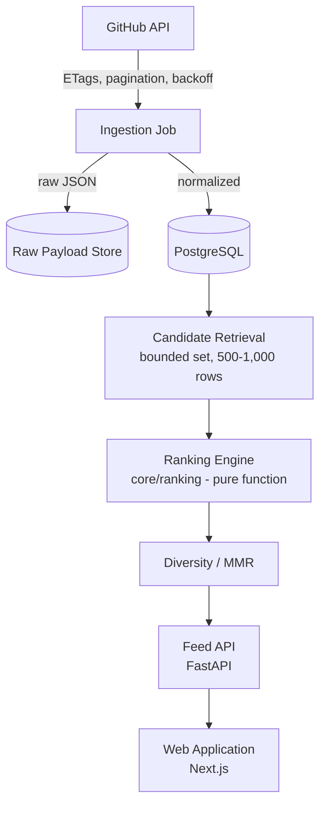

# DevFeed

A personalized discovery feed for developers, built on GitHub's repository ecosystem.

Instead of scrolling entertainment content, you scroll GitHub repositories — AI and ML projects, developer tools, data engineering pipelines, research implementations, infrastructure and security tools, robotics, and general engineering work. DevFeed ranks and personalizes that feed instead of leaving discovery to search, stars, or word of mouth.

**Full specification:** [`DEVFEED.md`](./DEVFEED.md) — the complete product and engineering reference. This README is an entry point, not a substitute for it.

## Status: Stage 0

The project is in Stage 0 — the Scroll Test. The only question this stage answers: can a ranked feed of GitHub repositories be built that's genuinely worth scrolling? Everything at this stage is deliberately throwaway — no auth, no production backend, no AI, no deployed infrastructure. See [`DEVFEED.md` §5](./DEVFEED.md#5-development-strategy) and [§28](./DEVFEED.md#28-immediate-next-steps) for the exact scope and gate criteria.

## Why DevFeed is different

- Ranking optimizes for useful discoveries per session, not time spent in the app.
- Stars are one input among several — repository quality is scored separately and explainably.
- No fake notifications, artificial scarcity, or engagement bait.
- Ranking is deterministic and explainable before any machine learning is introduced.

## Architecture



Full architecture, including failure handling and explicit non-goals, is in [`DEVFEED.md` §7](./DEVFEED.md#7-system-architecture).

## Technology stack

| Layer | Choice |
|---|---|
| Frontend | Next.js, React, TypeScript, Tailwind CSS |
| Backend | Python, FastAPI, Pydantic |
| Database | PostgreSQL (SQLAlchemy + Alembic) |
| Ranking | Deterministic Python — no ML at this stage |
| Search | PostgreSQL full-text search |
| Infrastructure | Docker Compose locally; free-tier hosting to start |

Full rationale in [`DEVFEED.md` §8](./DEVFEED.md#8-technology-stack).

## Development roadmap

| Stage | Focus |
|---|---|
| 0 — Scroll Test *(current)* | Prove a ranked feed of GitHub repos is worth scrolling |
| 1 — Ranking Engine | Make ranking measurable against a labeled evaluation set |
| 2 — Public Product | Smallest real, deployed version |
| 3 — User Validation | Real usage data from 10–20 developers |
| 4+ | Production infrastructure, personalization, semantic search, AI project intelligence, learning mode, and more — introduced one at a time, each behind its own trigger |

Full stage definitions, gates, and infrastructure triggers are in [`DEVFEED.md` §5](./DEVFEED.md#5-development-strategy) and [§26](./DEVFEED.md#26-milestones-and-gates).

## Repository structure

Right now, this repository contains project documentation and contribution setup only — no application code yet.

```
DEVFEED.md              # complete product and engineering specification
README.md
CONTRIBUTING.md
CODE_OF_CONDUCT.md
SECURITY.md
.github/                # PR and issue templates
```

As Stage 0 work begins, a `scripts/` directory (the corpus-fetching and ranking script) and a `data/` directory (raw payloads, evaluation dataset, category taxonomy) get added. The full target structure for later stages is documented in [`DEVFEED.md` §25](./DEVFEED.md#25-development-workflow).

## Getting started

1. Read [`DEVFEED.md`](./DEVFEED.md), at minimum §1–5 for context and §28 for what's being built right now.
2. Check open issues for current Stage 0 work.
3. See [`CONTRIBUTING.md`](./CONTRIBUTING.md) for the development workflow, branch naming, and commit conventions.

Prerequisites for when application code lands: Python 3.11+, Node.js 18+, PostgreSQL, and a GitHub personal access token for API ingestion. Nothing to install yet for documentation-only contributions.

## Contributing

Issue → branch → implementation → tests → pull request → review → CI → merge. Full workflow, branch naming, and commit conventions in [`CONTRIBUTING.md`](./CONTRIBUTING.md).
