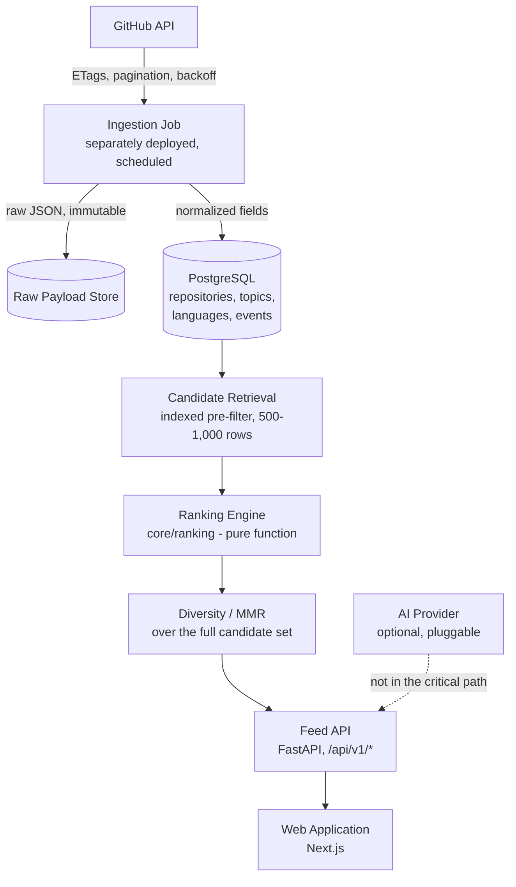

# Architecture Overview

> **State: Current Design.** This is the defined target architecture for the Stage 0–3 build — a decision that has been made, not code that has been written. No component below is implemented; the repository contains no `core/`, `api/`, or `web/` directories yet. See [`component-design.md`](./component-design.md) for the current-design repository layout.

## System diagram

Source: [`DEVFEED.md` §7](../../DEVFEED.md#7-system-architecture).

## Why each component exists

**Ingestion is separate from the API** because an API redeploy should never silently affect whether ingestion runs, and the reverse should hold too — they're different failure domains and different deployment cadences (ingestion runs on a schedule; the API serves requests continuously). See [ADR-0003](../decisions/ADR-0003-ingestion-separate-deployment.md).

**The ranking engine sits outside the API**, in its own module (`core/ranking/`), because it's the core technical asset of the product and is meant to eventually be shared across feed, search, trending, and recommendations. It has no framework, database, or network dependency — it takes candidates and a user profile in, and returns a ranked, explainable list out. The API depends on ranking; ranking never depends on the API. See [ADR-0002](../decisions/ADR-0002-ranking-engine-isolation.md).

**PostgreSQL pre-filters to a bounded candidate set (500–1,000 rows)** before ranking runs, because running the diversity pass (MMR) against tens of thousands of candidates on every request would blow the feed's performance budget. Ranking never touches the full corpus. See [`scalability.md`](./scalability.md).

**The AI provider is drawn as optional and off the critical path** because AI is designed as an enhancement layer, never a dependency — if it's unavailable, slow, or erroring, the feed, search, and save functionality keep working unaffected. It doesn't exist yet (Stage 7+); it's shown here because the architecture is designed around its eventual, non-blocking presence.

## Architectural principles

- **Modular monolith, not microservices.** Domain boundaries are enforced by module structure, not network boundaries, until a specific component demonstrably needs independent scaling or deployment.
- **Ranking is a pure function.** No I/O, no framework imports, deterministic output, every result carries a `score_breakdown`.
- **Ingestion is its own deployment target,** never a background process riding inside the API server.
- **GitHub is treated as an unreliable external dependency**, not a data source under the project's control — rate limits, partial fields, downtime, and stale data are the expected case, and ingestion code is written defensively throughout.

## External dependencies and failure posture (Current Design — describes intended system response, not observed behavior)

| Dependency | Failure mode | Designed system response |
|---|---|---|
| GitHub API | Rate limit exhausted, 5xx, timeout | Ingestion is designed to back off and retry; stale data is designed to be served; the feed is designed to be unaffected |
| AI Provider (future) | Unavailable, slow, erroring | Explainer/summary features are designed to degrade gracefully; feed, search, and saves are designed to be unaffected |
| PostgreSQL | Unavailable | Full outage — the one dependency the system is designed to be unable to degrade around |

Source: [`DEVFEED.md` §7](../../DEVFEED.md#7-system-architecture).

## Explicit non-goals for the current architecture

Microservices, Kubernetes, Kafka or any event-streaming platform, Elasticsearch/OpenSearch, Redis/Celery/background task queues, `pgvector` or any vector database, authentication, and a social graph are all explicitly out of scope for the current architecture. Each has a named trigger condition in [`roadmap.md`](../product/roadmap.md) — none is a permanent rejection, all are sequencing decisions.
