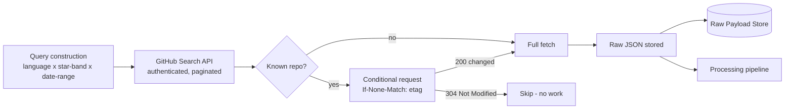
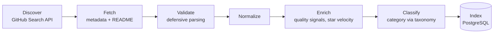
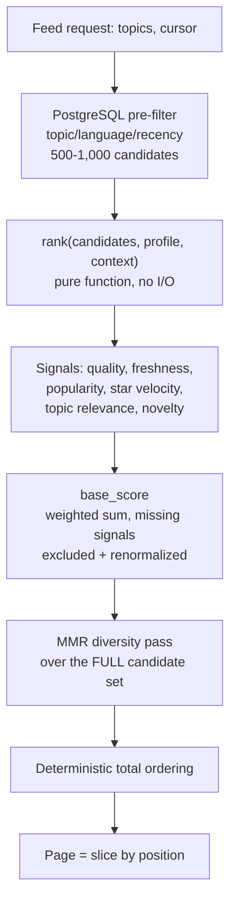

# Data Flow

> **State: Current Design.** These are the defined Stage 0–2 pipelines, not running software — none of the pipelines below execute anywhere, and no ingestion job or ranking code exists in the repository.

## Ingestion flow

Every re-fetch of a known repository sends `If-None-Match` with the stored ETag; a `304` means nothing changed and no further work happens. Full detail in [`github-data.md`](../data/github-data.md).

## Repository processing pipeline

Each stage is independently observable and independently retryable. A repository that fails to parse or fetch is marked `error` in `sync_status` with a reason and skipped — it never aborts the whole ingestion run. Two later stages, embedding generation and recommendation precomputation, are Stage 6+ future work and are not part of this pipeline. Source: [`DEVFEED.md` §9](../../DEVFEED.md#9-github-ingestion)–[§10](../../DEVFEED.md#10-repository-data-model).

## Feed request flow

Ranking is designed to run synchronously in the request path at Stage 2 volumes, against the bounded candidate set — never the full corpus. No ranking code exists yet to execute this. Source: [`DEVFEED.md` §12](../../DEVFEED.md#12-ranking-engine)–[§13](../../DEVFEED.md#13-feed-generation-and-pagination).

## Where data moves at rest vs. in flight

| Data | At rest | Moves through |
|---|---|---|
| Raw GitHub API payloads | Local disk (Stage 0) → object storage (Stage 2+) | Ingestion job only; never read directly by the API |
| Normalized repository records | PostgreSQL `repositories` and join tables | Written by ingestion; read by candidate retrieval and search |
| Ranked feed results | Not persisted — computed per request | Candidate retrieval → `rank()` → MMR → API response |
| Anonymous events | PostgreSQL `user_events` | Written synchronously by `POST /api/v1/events`; read only for Stage 3 analysis |

Source: [`DEVFEED.md` §9](../../DEVFEED.md#9-github-ingestion), [§19](../../DEVFEED.md#19-database-architecture), [§20](../../DEVFEED.md#20-api-specification).
