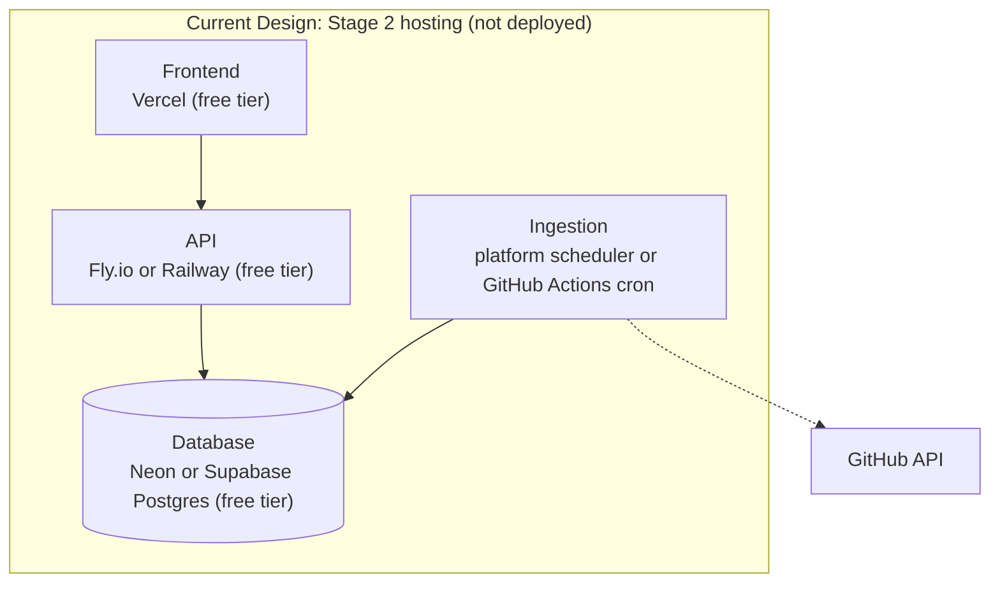

# Deployment Architecture

> **State: Current Design (local dev target and Stage 2 production plan); Proposed (future production infrastructure sketch, marked separately below).** Production deployment is not currently implemented. Nothing described in this document has been stood up — there is no hosting account, no provisioned database, and no deployed instance of any kind.

## Local development (Current Design)

```
Web (Next.js) --+
                 +--> API (FastAPI) --> PostgreSQL (Docker Compose)
Ingestion -------+         ^
                     GitHub API
```

Only PostgreSQL is intended to run in a container locally — the API and frontend run natively. Source: [`DEVFEED.md` §22](../../DEVFEED.md#22-deployment-and-infrastructure).

## Stage 2 production (Current Design — not deployed)



Ingestion stays its own deployment target even if it runs on the same underlying provider as the API — an API redeploy should never affect whether ingestion runs, and vice versa. No container orchestration, no multi-region setup, no CDN configuration beyond the hosting platform's defaults. Infrastructure providers are treated as configuration, not baked into application code, so swapping a provider later shouldn't touch business logic. Source: [`DEVFEED.md` §22](../../DEVFEED.md#22-deployment-and-infrastructure).

**Note on specificity:** the exact platform within each category (Fly.io vs. Railway; Neon vs. Supabase) is not yet a final decision — `DEVFEED.md` presents both as acceptable options and defers the pick to when Stage 2 deployment actually happens. See [ADR-0012](../decisions/ADR-0012-deployment-hosting-approach.md).

## Future production infrastructure (Proposed — directional sketch only)

```
Frontend → API → Application Services → PostgreSQL → Redis → Background Workers → GitHub / AI Providers
```

None of this exists, and DEVFEED.md is explicit that distributed architecture is not introduced ahead of a demonstrated need. This diagram is included only because it appears in the source document as a directional sketch of what might eventually be needed — it is not a design, and no component in it has been sized, chosen, or scheduled. Source: [`DEVFEED.md` §22](../../DEVFEED.md#22-deployment-and-infrastructure).

## Budget constraint

The initial infrastructure budget target is ₹0 — GitHub, open-source software, free hosting tiers, free databases, and local models where practical. Money isn't spent until the product demonstrates demand; the first real expense is expected to be a domain name. This constraint is a real driver of the free-tier hosting choices above, not an afterthought. Source: [`DEVFEED.md` §3](../../DEVFEED.md#3-goals-and-non-goals), [§22](../../DEVFEED.md#22-deployment-and-infrastructure).
