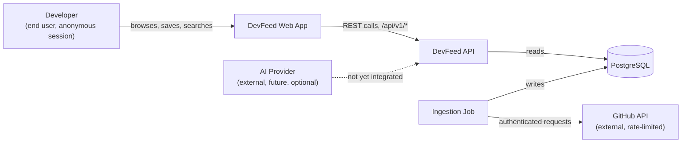

# System Context

> **State: Current Design.** Describes the defined system boundary for the Stage 2 build; nothing below is deployed or implemented.

## Actors and external systems

## System boundary

DevFeed's boundary is: a web frontend, a backend API, a PostgreSQL database, and a separately-scheduled ingestion job — all under project control. Everything else is external:

| External system | Role | Trust posture |
|---|---|---|
| GitHub REST/Search API | Sole source of repository data | Treated as unreliable — rate-limited, partial, and occasionally down; ingestion is written defensively (see [`github-data.md`](../data/github-data.md)) |
| End user's browser | Runs the Next.js frontend, holds the anonymous `session_id` and `localStorage` saves | No account exists at Stage 2; the browser is the only place client state lives |
| AI Provider (future) | Would supply LLM/embedding calls for project explanations | Not integrated in the current build; designed to sit behind a provider-independent interface so it's never a hard dependency (see [`DEVFEED.md` §16](../../DEVFEED.md#16-ai-project-intelligence)) |

## What's explicitly outside the boundary

DevFeed does not manage GitHub accounts, does not write back to GitHub (no stars, no forks, no issues opened on a user's behalf), and does not execute any code from an ingested repository. Repository content is read-only, untrusted input at every stage — see [`threat-model.md`](../security/threat-model.md).

## Interfaces at the boundary

| Interface | Direction | Protocol | Status |
|---|---|---|---|
| GitHub Search/REST API | Ingestion → GitHub | HTTPS, authenticated (PAT) | Planned, Stage 0 |
| DevFeed public API | Web app → API | HTTPS REST, `/api/v1/*` | Planned, Stage 2 (see [`api-overview.md`](../api/api-overview.md)) |
| Health check | External monitor → API | HTTPS, unversioned `/health` | Planned, Stage 2 |

Source: [`DEVFEED.md` §7](../../DEVFEED.md#7-system-architecture), [§9](../../DEVFEED.md#9-github-ingestion), [§20](../../DEVFEED.md#20-api-specification).
