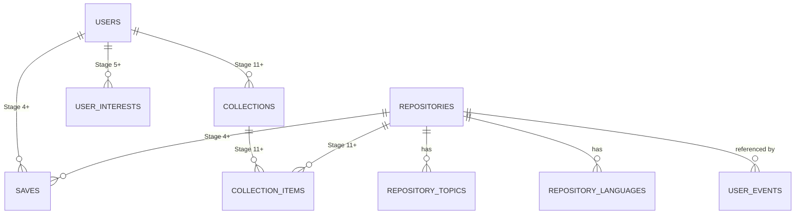

# Data Model

> **State: Current Design (Stage 2 tables); Planned (Stage 4+ tables, marked individually below).** No database, no migrations, and no ORM models exist in the repository yet. This describes the data model design from `DEVFEED.md` §19.

## Entities

| Entity | Purpose | Target stage | Status |
|---|---|---|---|
| `repositories` | System of record for ingested GitHub data | Stage 2 | Current Design |
| `repository_topics` | Many-to-many: repository ↔ topic | Stage 2 | Current Design |
| `repository_languages` | Many-to-many: repository ↔ language, with byte counts | Stage 2 | Current Design |
| `user_events` | Anonymous interaction tracking (view/open/save) | Stage 2–3 | Current Design |
| `users`, `user_profiles`, `saves` | Accounts and server-side saves | Stage 4 | Planned — no schema drafted |
| `user_interests`, `likes`, `follows` | Behavioral personalization / social primitives | Stage 4–5 | Planned — no schema drafted |
| `repository_embeddings` | Semantic search vectors | Stage 6 | Planned — no schema drafted |
| `repository_analyses`, `ai_explanations` | AI project intelligence output | Stage 7 | Planned — no schema drafted |
| `learning_paths` | Learning mode | Stage 8 | Planned — no schema drafted |
| `collections`, `collection_items` | User-curated project groups | Later, once saving 20+ repos is common | Planned — no schema drafted |
| `comments` | Social/discussion layer | Stage 10 | Planned — no schema drafted |

Full column-level detail for the active Stage 2 tables is in [`database-schema.md`](./database-schema.md).

## Relationships

## Design conventions (planned, apply once implemented)

- Foreign keys are always declared explicitly, never implicit.
- Every table has `created_at`; mutable tables also have `updated_at`.
- Soft deletion is used only where a hard delete would break referential integrity someone actually cares about — not applied by default.
- No table gets created for a minor concept that could just be a column or a `jsonb` field.
- Migrations are Alembic-managed and reviewed by hand — `alembic revision --autogenerate` produces a draft, not a decision.

## Why `users` and `saves` don't exist yet

There is deliberately no `users` table and no `saves` table at Stage 2. Stage 2 saves are `localStorage`-only on the client and never touch the database — a table with no writer is infrastructure built before the product needs it. Both arrive together at Stage 4, alongside authentication, built with a `user_id` foreign key from the start rather than retrofitted onto something that predates login.

## Field provenance

Every field on `repositories` traces to a specific source:

- Directly from the GitHub API (owner, name, stars, forks, license, timestamps, etc.) — see [`github-data.md`](./github-data.md).
- Derived by DevFeed's own processing (`quality_score`, `star_growth_ratio_30d`, `has_tests`, `has_ci`) — see [`DEVFEED.md` §11](../../DEVFEED.md#11-repository-quality-and-classification)–[§12](../../DEVFEED.md#12-ranking-engine).
- Ingestion bookkeeping, not repository content (`sync_status`, `etag`, `last_synced_at`).

Data is never assumed complete — GitHub records are frequently missing fields, and every downstream consumer is designed to handle absence explicitly rather than assume presence.

Source: [`DEVFEED.md` §10](../../DEVFEED.md#10-repository-data-model), [§19](../../DEVFEED.md#19-database-architecture).
