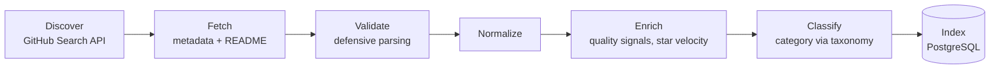

# Data Pipeline

> **State: Current Design.** No pipeline code exists in the repository. This documents the specified processing sequence from `DEVFEED.md` §10, which is the concrete Stage 0 next step per §28 — near-term build target, not deferred future work.

## Pipeline stages



Each stage is designed to be independently observable and independently retryable — discover candidates, fetch their data, validate what came back, normalize it into a consistent shape, enrich it with derived signals (quality score, star velocity), classify it into a category, and index it into PostgreSQL.

| Stage | What it does | Depends on |
|---|---|---|
| Discover | Runs the sliced GitHub Search API queries (see [`github-data.md`](./github-data.md)) | GitHub API availability |
| Fetch | Retrieves metadata, and README/contributor/release data for repos that survive initial filtering | Discover |
| Validate | Defensive parsing — tolerates missing/null/unexpected fields | Fetch |
| Normalize | Shapes validated data into a consistent internal representation | Validate |
| Enrich | Computes `quality_score`, `star_growth_ratio_30d`, and related derived signals | Normalize |
| Classify | Assigns a category via the hand-maintained topic taxonomy | Enrich |
| Index | Writes into PostgreSQL (`repositories` and join tables) | Classify |

## What's explicitly not part of this pipeline yet

Two later stages — embedding generation and recommendation precomputation — are Stage 6+ future work and are explicitly excluded from the current pipeline design. Adding them prematurely would be infrastructure ahead of a demonstrated need for semantic search or precomputed recommendations, neither of which exists yet.

## Filtering and classification (pre-ranking)

Not every ingested repository belongs in the feed — filtering happens in the Enrich/Classify stages, before ranking ever sees a candidate:

- **Positive signals:** meaningful description, GitHub topics, a license, a README with actual code examples, recent activity, multiple contributors, tests, CI configuration, releases, general documentation quality.
- **Negative signals:** archived, forked, or effectively dead repositories; a name/description matching a known junk pattern; suspicious star growth that looks manufactured; a README that's mostly badges with little substance.
- **Junk patterns** (maintained as configuration, not hard-coded): `awesome-`, `-awesome`, `tutorial`, `course`, `bootcamp`, `interview-`, `-questions`, `roadmap`, `cheatsheet`, `dotfiles`, `my-portfolio`, `learning-`, `100-days`, `leetcode`, `hackerrank`, `curriculum`, `resources`, `-notes`, `study-`, `practice-`, `assignment`.

## Category taxonomy

Category is derived deterministically from a fixed topic-to-category lookup table (e.g., `ai-agents` → `AI`, `dbt` → `Data Engineering`), not a classifier — reproducibility matters because category feeds the diversity evaluation in [ranking](../architecture/tradeoffs.md). Repositories with no topic match fall into `Uncategorized` and are excluded from the diversity metric rather than silently miscounted. The table is hand-maintained and carries a version number, incremented whenever a change could alter a repository's assigned category — evaluation runs from different taxonomy versions are never compared directly, so a taxonomy edit is never mistaken for a ranking regression.

```yaml
# data/taxonomy/topic_categories.yaml
taxonomy_version: 1
categories:
  AI:
    - ai
    - llm
    - rag
    - agents
  Data Engineering:
    - airflow
    - dbt
    - spark
```

## What's this document is not claiming

This is a pipeline **design**, not a running system. No script in the repository executes any of these stages yet — the first concrete deliverable is the Stage 0 script described in [`roadmap.md`](../product/roadmap.md).

Source: [`DEVFEED.md` §9](../../DEVFEED.md#9-github-ingestion)–[§11](../../DEVFEED.md#11-repository-quality-and-classification), [§28](../../DEVFEED.md#28-immediate-next-steps).
