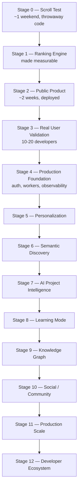

# Roadmap

> **State: Project stage is Stage 0 (implemented fact — verified against the repository's actual file listing).** Stages 0–3 are Current Design — the committed near-term build ("current build" in `DEVFEED.md`'s own terminology), decided but not implemented. Stage 4 onward is Planned — explicitly named future work, gated by evidence, not calendar time.

## Where the repository actually is right now

The repository contains project documentation, governance files (`CONTRIBUTING.md`, `CODE_OF_CONDUCT.md`, `SECURITY.md`), and GitHub issue/PR templates. **No application code, no `scripts/`, no `data/`, and no `core/`/`api/`/`web/` directories exist yet.** Stage 0 work (below) has not started in this repository as of this documentation pass. Source: repository file listing, `README.md` ("Status: Stage 0").

## Stage sequence

## Current Design build target: Stage 0–3

| Stage | Objective | Output | Gate |
|---|---|---|---|
| 0 — Scroll Test | Prove a ranked feed of GitHub repos is genuinely interesting | 100 ranked repos, static HTML page | ≥15/100 clickable, ≥3 unknown-and-interesting, <20/100 junk |
| 1 — Ranking Engine | Make ranking measurable instead of vibes-based | Labeled evaluation dataset, evaluation harness | Precision@25 ≥ 0.50, junk rate < 10%, 5+ categories in top 25 |
| 2 — Public Product | Smallest real, deployed version | Public URL, live feed, automatic nightly ingestion | Fast load, 200+ browsable repos, ranking tests passing, 5 days of personal use |
| 3 — User Validation | Test with real developers | Usage data from 10–20 developers | ≥2 opens/session, ≥5% save rate, ≥30% day-7 return |

Stage 0 through Stage 3 is roughly six to eight weeks of work once started. Everything past that is earned by evidence, not scheduled by calendar. Source: [`DEVFEED.md` §5](../../DEVFEED.md#5-development-strategy).

**Immediate next step (Stage 0), concretely:** a script querying GitHub's Search API across the language × star-band × date-range grid, raw JSON saved to local disk unmodified, deterministic quality/freshness scoring (no star velocity or MMR yet — those are Stage 1), junk-pattern filtering, and a static HTML page rendering the top ~100 results for a personal scroll-through against the Stage 0 gate. No auth, no database, no deployed backend, no AI. Source: [`DEVFEED.md` §28](../../DEVFEED.md#28-immediate-next-steps).

## Future: Stage 4 and beyond

| Stage | Focus |
|---|---|
| 4 — Production Foundation | Authentication, background workers, structured observability — each introduced behind its own trigger (see table below) |
| 5 — Personalization | Behavioral user profiles replacing topic-only selection |
| 6 — Semantic Discovery | Embeddings and similarity search (`pgvector`) |
| 7 — AI Project Intelligence | The project explainer and codebase-understanding layer |
| 8 — Learning Mode | Projects connected to prerequisites and learning paths |
| 9 — Knowledge Graph | Technologies, concepts, and projects as a connected graph |
| 10 — Social / Community | Following developers and topics, comments, activity — deliberately last |
| 11 — Production Scale | Whatever the system actually needs at real scale, decided when that's real |
| 12 — Developer Ecosystem | Long-term platform direction |

## What triggers each piece of Stage 4+ infrastructure

Nothing in Stage 4+ is scheduled — each item has a named, evidence-based trigger:

| Addition | Trigger |
|---|---|
| Redis + background workers | Ingestion or AI calls start blocking request latency |
| Structured logging, metrics, health checks | First production incident that was hard to diagnose without them |
| Authentication | Users ask for saves to persist across devices |
| `pgvector` + embeddings | Keyword topic-matching visibly fails on nuanced interests |
| AI provider integration | Feed quality is proven and users start asking "what is this?" |
| Knowledge graph / additional stores | Learning-mode usage demonstrates real demand |
| Collections | Users are regularly saving 20+ repos and losing track |
| Social layer | The discovery engine has already proven itself on its own |
| Service extraction (microservices) | A specific component provably needs independent scaling |

Source: [`DEVFEED.md` §26](../../DEVFEED.md#26-milestones-and-gates). The kill criteria in [`success-metrics.md`](./success-metrics.md) apply throughout — no later stage overrides evidence that an earlier one isn't working.

## Stage 3 pivot (contingency, not failure)

If users find individual projects useful but don't come back regularly, DEVFEED.md treats that as a legitimate outcome, not a failure — DevFeed may be a strong discovery/search tool rather than a daily feed. The documented pivot in that case is search-first, with the feed as a secondary surface rather than the primary interface. Source: [`DEVFEED.md` §5](../../DEVFEED.md#5-development-strategy).

## Long-term direction (Planned — DEVFEED.md §27 is explicitly titled "Future Roadmap"; Stage 12 horizon)

Beyond Stage 4–11, `DEVFEED.md` §27 sketches a longer-term product direction — a "build mode" (describe what you want to build, get back projects/architectures/learning paths), a "research mode" connecting papers to implementations, and a broader developer knowledge graph connecting developers, projects, technologies, and concepts. This qualifies as Planned rather than Current Design because the repository explicitly identifies it as future work, but it's worth flagging that — unlike Stage 4–11 — none of this has a trigger condition defined anywhere, so treat it as directional intent, closer to Proposed in practice, rather than a committed roadmap item with a clear activation point.
